 

# Cycle1337

**`Systems Hacker / Full-Stack Builder / Reverse Engineer`**

 

 

> *"I'll become whoever I need to be."* — Toga Himiko

*Built with obsession. Driven by curiosity.*

---

## GitHub Stats

 

---

## Tech Stack

